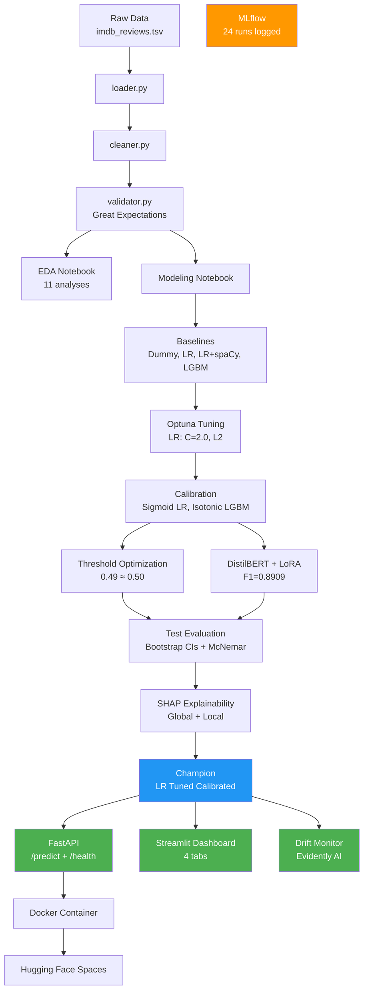
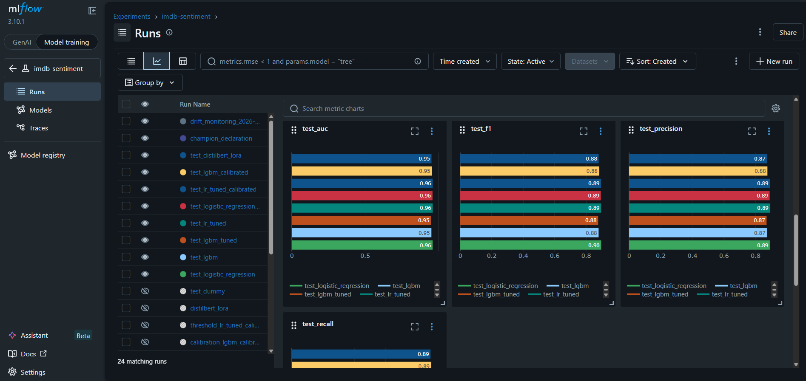

# IMDB Sentiment Classifier

[](https://imdb-sentiment-mcgn.streamlit.app/)


**[Live Demo](https://imdb-sentiment-mcgn.streamlit.app/)** | **[Live API](https://marianunez-data-imdb-sentiment-classifier.hf.space/docs)**

**Production-grade binary sentiment classifier for IMDB movie reviews**: comparing Logistic Regression (LR), LightGBM, and DistilBERT with full MLOps pipeline.


## Results

| Model                              | Test F1    | 95% CI          | AUC    | Inference |
| ---------------------------------- | ---------- | --------------- | ------ | --------- |
| **LR Tuned Calibrated** (champion) | **0.8948** | [0.8906-0.8988] | 0.9605 | 2.9 ms    |
| LR Default                         | 0.8954     | [0.8908-0.8992] | 0.9599 | 0.3 ms    |
| DistilBERT + LoRA                  | 0.8796     | [0.8753-0.8841] | 0.9523 | 24.9 ms   |
| LGBM Calibrated                    | 0.8828     | [0.8782-0.8870] | 0.9542 | 33.6 ms   |

**Champion**: LR Tuned Calibrated: selected for calibrated probability quality (Brier=0.0789), not just F1. Enables confidence-based routing: auto-classify (>85%), human review (60-85%), escalate (<60%).

## Architecture


## Key Findings

- **Linear separability**: LR with TF-IDF bigrams matches DistilBERT (F1=0.8948 vs 0.8796), confirming sentiment in this dataset is linearly separable in bigram space.
- **Hyperparameter tuning**: Optuna found C=2.0 (vs default 1.0) for +0.0012 F1, minimal gain. LGBM tuning produced worse results with only 8 trials (insufficient for 7-dimensional search space).
- **Calibration matters**: McNemar's test shows LR default and LR calibrated make identical predictions (p=0.54). The champion wins on probability quality (Brier 0.0789 vs 0.0884), critical for confidence-based routing.
- **BERT truncation impact**: 41.4% of reviews truncated at max_length=256 tokens.
- **Estimated production cost**: LR at ~$50/month (CPU) vs BERT at ~$500/month (GPU), 10x cost for lower F1. Estimates based on AWS on-demand pricing, US East, April 2026.

## Features

### FastAPI Endpoint
```bash
# Live API (Hugging Face Spaces)
curl -X POST https://marianunez-data-imdb-sentiment-classifier.hf.space/predict \
  -H "Content-Type: application/json" \
  -d '{"review": "This movie was absolutely amazing, best film ever"}'

# Local
curl -X POST http://localhost:8000/predict \
  -H "Content-Type: application/json" \
  -d '{"review": "This movie was absolutely amazing, best film ever"}'
```

Response:
```json
{
  "sentiment": "positive",
  "probability": 0.9829,
  "confidence_level": "high",
  "routing_action": "auto_classify",
  "top_positive_words": [{"word": "amazing", "score": 1.34}, {"word": "best", "score": 0.77}],
  "top_negative_words": [{"word": "was", "score": -0.23}]
}
```

### Streamlit Dashboard
4-tab interactive dashboard:
- **Live Prediction**: Real-time sentiment analysis with SHAP word highlighting
- **Model Comparison**: 8 models side-by-side with bootstrap CIs, latency, and estimated cost analysis
- **Explainability**: Top 20 SHAP features + 3 annotated example predictions
- **Production Monitor**: Evidently AI drift detection with embedded report

### Drift Monitoring
```bash
python -m monitoring.drift_report
```
Splits test set 50/50 to simulate reference vs production data. Generates Evidently HTML report + JSON summary with drift detection status.

### Experiment Tracking (MLflow)
All experiments logged to MLflow with full reproducibility:
- Baseline CV results (F1, AUC, precision, recall per model)
- Optuna hyperparameter search (19 LR trials, 8 LGBM trials)
- Calibration comparisons (sigmoid vs isotonic, Brier scores)
- Test evaluation metrics with bootstrap CIs
- Drift monitoring results
```bash
mlflow ui --port 5000
# Open http://localhost:5000 to explore experiments
```



## Quick Start

### Prerequisites
- Python 3.12+
- NVIDIA GPU (optional, for DistilBERT training only)

### Setup
```bash
git clone https://github.com/marianunez-data/imdb-sentiment-classifier.git
cd imdb-sentiment-classifier
python -m venv .venv
source .venv/bin/activate
pip install -r requirements.txt
```

### Run API
```bash
uvicorn app.main:app --host 0.0.0.0 --port 8000
# API docs: http://localhost:8000/docs
```

### Run Dashboard
```bash
streamlit run streamlit_app/app.py --server.port 8501
```

### Run with Docker
```bash
docker build -t imdb-sentiment .
docker run -p 8000:8000 imdb-sentiment
```

### Run Tests
```bash
pytest tests/ -v
# 24 tests: 7 API endpoints, 8 model artifacts, 9 config validation
```

## CI/CD

GitHub Actions runs the full test suite on every push and pull request:

```yaml
# .github/workflows/tests.yml
name: Tests
on: [push, pull_request]
jobs:
  test:
    runs-on: ubuntu-latest
    steps:
      - uses: actions/checkout@v4
      - uses: actions/setup-python@v5
        with:
          python-version: '3.12'
      - run: pip install -r requirements.txt
      - run: pytest tests/test_config.py -v
```

### Retrain Models
```bash
# Data file required: data/imdb_reviews.tsv
python -m src.models.train           # Classical baselines
python -m src.models.tuning          # Optuna LGBM tuning
python -m src.models.calibration     # Probability calibration
python -m src.models.threshold       # Threshold optimization
python -m src.bert.fine_tune         # DistilBERT + LoRA
python -m src.models.evaluate        # Test evaluation
python -m src.models.explain         # SHAP analysis
```

## Project Structure

```
├── app/                          # FastAPI inference endpoint
│   └── main.py                   # /predict + /health + SHAP + routing
├── configs/
│   └── config.yaml               # All hyperparameters and settings
├── monitoring/
│   └── drift_report.py           # Evidently AI drift simulation
├── notebooks/
│   ├── 01_eda_exploration.ipynb   # EDA with data story
│   └── 02_modeling_evaluation.ipynb  # Full modeling pipeline
├── reports/
│   ├── figures/                  # 20 interactive HTML charts
│   └── metrics/                  # 12 JSON result files
├── src/
│   ├── bert/                     # DistilBERT fine-tuning + inference
│   ├── data/                     # Loader, cleaner, validator
│   ├── features/                 # Text preprocessing
│   ├── models/                   # Train, tune, calibrate, evaluate, explain
│   └── utils/                    # Structured logging
├── streamlit_app/
│   └── app.py                    # 4-tab interactive dashboard
├── tests/                        # 24 tests (API, models, config)
├── Dockerfile                    # Production container
├── docker-compose.yml
└── pyproject.toml                # pytest + ruff config
```

## Tech Stack

| Category       | Tools                                                         |
| -------------- | ------------------------------------------------------------- |
| ML             | scikit-learn, LightGBM, DistilBERT + LoRA (PEFT), Optuna      |
| Explainability | SHAP                                                          |
| API            | FastAPI, Pydantic, Hugging Face Spaces, Mangum (Lambda-ready) |
| Monitoring     | Evidently AI, MLflow                                          |
| Dashboard      | Streamlit, Plotly                                             |
| Infrastructure | Docker, pytest, GitHub Actions                                |
| Data Quality   | Great Expectations                                            |

## Author

**Maria Camila Gonzalez Nuñez**

[](https://www.linkedin.com/in/marianunez-data)
